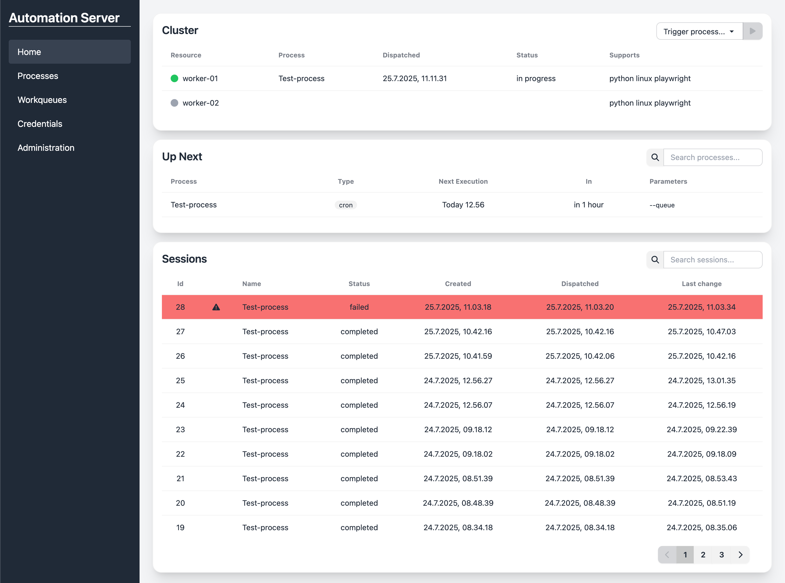

# Automation Server

[](https://github.com/odense-rpa/automation-server)
[](LICENSE)
[](https://github.com/odense-rpa/automation-server/issues)

<a href="docs/images/main-interface.png"></a>

Automation Server allows you to build, run and monitor automations written in python. Easily orchestrate your automations and deploy them on workers dynamically. Jobs get routed to workers based on their capabilities and resources are automatically utilized.


- **Web Interface:** At a single glance you can monitor status, trigger automations and see the overall health of your cluster. Manage all aspects of your automations
- **Automations on time:** Use powerful cron based triggers to ensure your automations run when you want them to. You can also trigger on specific date and times. Workqueues provide flexible triggering based on the amount of work to do.
- **Audit your automations:** Built-in logging and integration with Pythons logging system provides a clear audit-trail. All logs are grouped by their sessions and associated workitems allowing for ease if access and operations.
- **Templates for automations:** Automation Server provides a framework for interacting with the server from your processes. There is also a [template](https://github.com/odense-rpa/process-template) to get you started.
- **Isolated execution:** Each worker runs a single automation at the time and it is isolated in it's private environment, thus ensuring stability and package integrity.

## Requirements

- Docker and Docker-compose installed.

## Get started

To setup a local copy of Automation Server follows the steps below. If you wish to run this in production we recommend you follow our [deployment guide](docs/deployment.md).

1. **Clone and setup environment**:
   ```bash
   git clone https://github.com/odense-rpa/automation-server.git
   cd automation-server
   cp .env.example .env
   ```

2. **Start all services**:
   ```bash
   docker-compose up -d
   ```

3. **Access the  local application**:
   - **Web Interface**: http://localhost
   - **API Documentation**: http://localhost/api/docs
   - **Database Admin** (optional): http://localhost:8080


## Next steps

To get started with developing your own automations take a look at our [template](https://github.com/odense-rpa/process-template). You can also add our [test process](https://github.com/odense-rpa/test-process) to your local installation and try the scheduling features.


If you require assistance feel free to create a [discussion](https://github.com/odense-rpa/automation-server/discussions) or open an [issue](https://github.com/odense-rpa/automation-server/issues).


## License

This project is licensed under the MIT License - see the [LICENSE](LICENSE) file for details.

## Contributing

1. Check our [issues](https://github.com/odense-rpa/automation-server/issues) for planned features
2. Open an issue to discuss your idea
3. Fork the repository and create a feature branch
4. Make your changes and add tests
5. Submit a pull request

For detailed documentation, see the [docs/](docs/) directory.