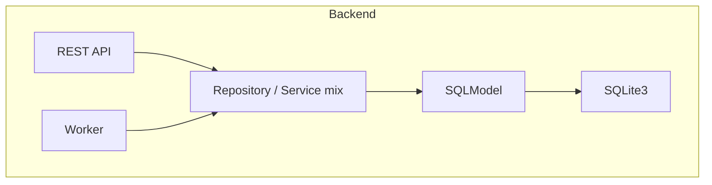
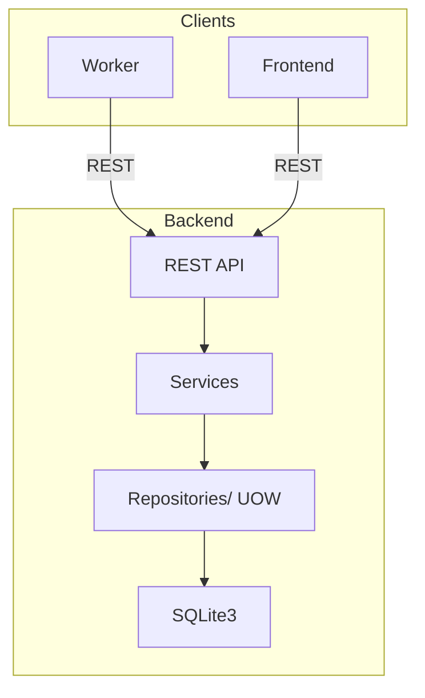

This is the current backend architecture. It has over time become a rather big mess and will be cleaned up in the future.

Currently we are aiming for an implementation that will look more like this.

