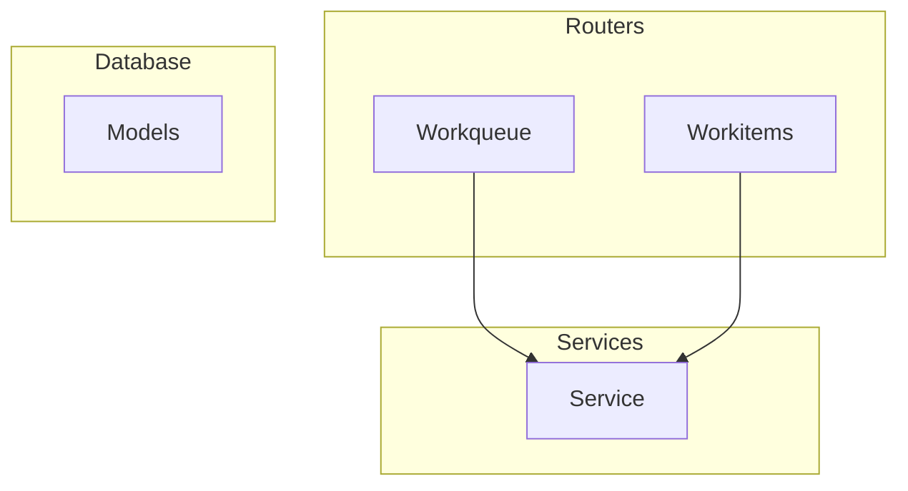

```mermaid

graph TD
    subgraph Routers
        FA-A[Workqueue]
        FA-B[Workitems]
    end
    subgraph Services
        SL-A[Service]
    end
    subgraph Database
        A[Models]
    end

    FA-A --> SL-A
    FA-B --> SL-A
```
