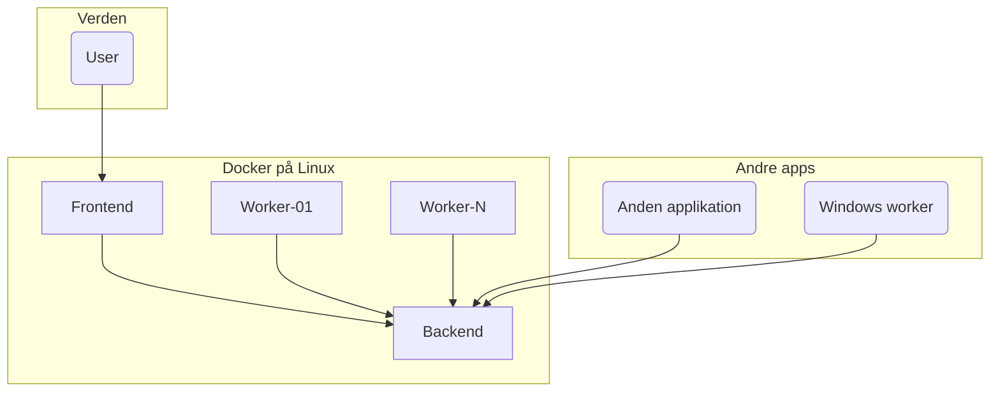

```code

version: '3.8'

services:
  api:
    image: ats:development
    ports:
      - "8000"
    networks:
      - app-network
    volumes:
      - api-data:/data  # Mount named volume to /data

  frontend:
    image: ats-frontend:development
    ports:
      - "80"
    networks:
      - app-network
    environment:
      - VITE_ATS_API_BASE_URL=/api  # Set environment variable

  proxy:
    image: nginx:latest
    ports:
      - "80:80"
      - "443:443"
    volumes:
      - ./nginx.conf:/etc/nginx/nginx.conf
    depends_on:
      - api
      - frontend
    networks:
      - app-network

  worker01:
    image: ats-worker:development
    environment:
      - ATS_URL=http://api:8000/  # Set environment variable
    hostname: worker-01
    networks:
      - app-network
    depends_on:
      - api

  worker02:
    image: ats-worker:development
    environment:
      - ATS_URL=http://api:8000/  # Set environment variable
    hostname: worker-02
    networks:
      - app-network
    depends_on:
      - api

networks:
  app-network:
    driver: bridge

volumes:
  api-data:
    driver: local
    driver_opts:
      type: none
      o: bind
      device: /opt/docker-files/database/development

```